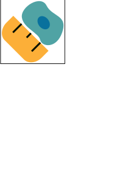

<div align="center">

</div>

# cp_measure: Morphological features for imaging data
Do you need to use [CellProfiler](https://github.com/CellProfiler) features, but you want to do it in a programmatic way? Look no more, this package was developed by and for the click-a-phobic scientists.

## Quick overview


### Installation

```bash
pip install cp-measure
```


### Development

If you want to install it for development use [uv](https://docs.astral.sh/uv/).

```bash
git clone git@github.com:afermg/cp_measure.git
cd cp_measure
uv sync --all-extras
```

### Usage

Users usually want to calculate all the features. There are four type of measurements, based on their inputs:

-   Type 1: 1 image + 1 set of masks (e.g., intensity)
-   Type 2: 2 images + 1 set of masks (e.g., colocalization)
-   Type 3: 2 sets of masks (e.g., number of neighbors)
-   Type 4: 1 image + 2 sets of masks (e.g., skeleton)

This shows the simplest way to use the first set (1 image, 1 mask set), which currently follows the style of scikit-image (1 image, 1 matrix with non-overlapping labels). **IMPORTANT:** If you need to match CellProfiler measurements 1:1, you must convert your image arrays to float values between 0 and 1. For instance, if you have an array of data type uint16, you must divide them all by 65535. This is important for radial distribution measurements.

```python
import numpy as np

from cp_measure.bulk import get_core_measurements

measurements = get_core_measurements()
print(measurements.keys())
# dict_keys(['radial_distribution', 'radial_zernikes', 'intensity', 'sizeshape', 'zernike', 'ferret', 'texture', 'granularity'])

import numpy as np
import pandas as pd
from cp_measure.bulk import get_core_measurements

# Create synthetic data
size = 240
rng = np.random.default_rng(42)
pixels = rng.integers(low=1, high=255, size=(size, size))

# Create two similar-sized objects
masks = np.zeros_like(pixels)
masks[50:100, 50:100] = 1  # First square 50x50
masks[80:120, 90:120] = 1  # Major asymmetries on bottom right edge
masks[150:200, 150:200] = 2  # Second square 50x50
masks[175:180, 180:210] = 2  # Minor asymmetries on bottom right edge

# Get measurements
measurements = get_core_measurements()

results = {}
for name, v in measurements.items():
    results = {**results, **v(masks, pixels)}

"""
{'RadialDistribution_FracAtD_1of4': array([0.03673493, 0.05640786]),
 'RadialDistribution_MeanFrac_1of4': array([1.02857809, 1.15072037]),
 'RadialDistribution_RadialCV_1of4': array([0.05539421, 0.04635982]),
 ...
 'Granularity_16': array([97.65759629, 97.64371833])}
"""
```


#### Call specific measurements

If you need a specific measurement/feature you can just import it. Note that measurements come in sets, so you have to fetch the one that you specifically require from the resultant dictionary. Any available measurement can be found using code as follows:

```python
import numpy as np

from cp_measure.minimal.measureobjectsizeshape import get_sizeshape

mask = np.zeros((50, 50))
mask[5:-6, 5:-6] = 1
get_sizeshape(mask, None) # pixels, the second argument, is not necessary for this particular measurement
```

The other available functions are as follows:

```
measureobjectintensitydistribution.get_radial_zernikes
measureobjectintensity.get_intensity
measureobjectsizeshape.get_zernike
measureobjectsizeshape.get_ferret
measuregranularity.get_granularity
measuretexture.get_texture
```

And for Type 2 functions:

```
measurecolocalization.get_correlation_pearson
measurecolocalization.get_correlation_manders_fold
measurecolocalization.get_correlation_rwc
measurecolocalization.get_correlation_costes
measurecolocalization.get_correlation_overlap
```
  
For Type 3 functions:

```
measureobjectoverlap.measureobjectoverlap
measureobjectneghbors.measureobjectneighboors
```

## Work in Progress

You can follow progress [here](https://docs.google.com/spreadsheets/d/1_7jQ8EjPwOr2MUnO5Tw56iu4Y0udAzCJEny-LQMgRGE/edit?usp=sharing).


### Done

-   Type 1 and 2 in sklearn style (multiple integer labels in one mask array)

### Pending

-   Add a wrapper for type 3 measurements
-   Type 4 measurements (ObjectSkeleton). We don't know if it is worth implementing.


# Additional notes

- The Image-wide functions will not be implemented directly, they were originally implemented independently to the Object (mask) functions. We will adjust the existing functions assume that an image-wide measurement is the same as measuring an object with the same size as the intensity image.
- This is not optimised for efficiency (yet). We aim to reproduce the 'vanilla' results of CellProfiler with minimal code changes. Optimisations will be implemented once we come up with a standard interface for functionally-focused CellProfiler components.
- The functions exposed perform minimal checks. They will fail if provided with empty masks. Not all functions will fail if provided with masks only.


## Similar projects

- [spacr](https://github.com/EinarOlafsson/spacr): Library to analyse screens, it provides measurements (independent implementation) and a GUI.
- [ScaleFEX](https://github.com/NYSCF/ScaleFEx): Python pipeline that includes measurements, designed for the cloud.
- [thyme](https://github.com/tomouellette/thyme): Rust library to extract a subset of CellProfiler's features efficiently (independent implementation).

## Cite
If you used cp\_measure in your project, please cite using the following bib entry:

```
@article{munoz2025cp_measure,
  title={cp\_measure: API-first feature extraction for image-based profiling workflows},
  author={Mu{\~n}oz, Al{\'a}n F and Treis, Tim and Kalinin, Alexandr A and Dasgupta, Shatavisha and Theis, Fabian and Carpenter, Anne E and Singh, Shantanu},
  journal={arXiv preprint arXiv:2507.01163},
  year={2025}
}
```
